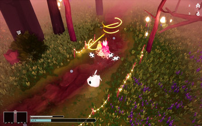
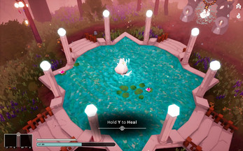
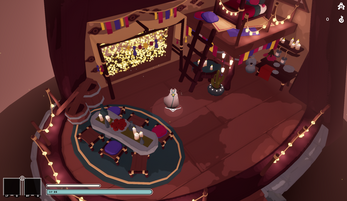
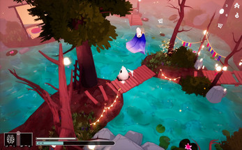

# Jonathan Hedén's Portfolio

This page contains previews of my projects, click on the titles to see my contributions!

## Games

<table>
  <tr>
  <td width="50%" rowspan="2">

### [SoulHerd](SoulHerd#soulherd)
**Development time**: Eight weeks (Apr - Jun '24)  
**Team size**: Three programmers, four artists  
**Engine**: Unreal 
      
  </td>
  <td width="25%" margin="0px" padding="0px"></td>
  <td width="25%" margin="0px" padding="0px"></td>
  </tr>
  <tr>
  <td width="25%"></td>
  <td width="25%"></td>
  </tr>
</table>

<table>
  <tr>
    <td width="50%" rowspan="2">

### [Spellslingers](Spellslingers#spellslingers)
**Development time**: Seven weeks (Nov '23 - Jan '24)  
**Team size**: Three programmers, three artists  
**Engine**: Unity  
      
  </td>
  <td width="25%" margin="0px" padding="0px"></td>
  <td width="25%" margin="0px" padding="0px"></td>
  </tr>
  <tr>
  <td width="25%"></td>
  <td width="25%"></td>
  </tr>
</table>

---

## Game Jams

<table>
  <tr>
    <td width="50%" rowspan="2">

### Global Game Jam 2024 - [Shake Spear](ShakeSpear#shakespear)
**Development time**: Three days (Apr '24)  
**Team size**: Three programmers, four artists  
**Engine**: Unity  
      
  </td>
  <td width="25%" margin="0px" padding="0px"></td>
  <td width="25%" margin="0px" padding="0px"></td>
  </tr>
  <tr>
  <td width="25%"></td>
  <td width="25%"></td>
  </tr>
</table>

---

<table>
  <tr>
    <td width="50%" rowspan="2">

### Leap Year Game Jam 2024 - [What is "Up"?](WhatIsUp#whatisup)
**Development time**: Eight hours (Feb '24)  
**Team size**: Solo  
**Engine**: Unity  
      
  </td>
  <td width="25%" margin="0px" padding="0px"></td>
  <td width="25%" margin="0px" padding="0px"></td>
  </tr>
  <tr>
  <td width="25%"></td>
  <td width="25%"></td>
  </tr>
</table>

---

<table>
  <tr>
    <td width="50%" rowspan="2">

### Yrgo Student Game Jam 2023 - [We Tethered Felines](WeTetheredFelines#wetetheredfelines)
**Development time**: Three days (Oct '23)  
**Team size**: Three programmers, two artists  
**Engine**: Unity  
      
  </td>
  <td width="25%" margin="0px" padding="0px"></td>
  <td width="25%" margin="0px" padding="0px"></td>
  </tr>
  <tr>
  <td width="25%"></td>
  <td width="25%"></td>
  </tr>
</table>

---

<table>
  <tr>
    <td width="50%" rowspan="2">
      
### Yrgo Student Game Jam 2023 - [Katt-Boom!](KattBoom#kattboom)
**Development time**: Three days (Sep '23)  
**Team size**: Two programmers, two artists  
**Engine**: Unity  
      
  </td>
  <td width="25%" margin="0px" padding="0px"></td>
  <td width="25%" margin="0px" padding="0px"></td>
  </tr>
  <tr>
  <td width="25%"></td>
  <td width="25%"></td>
  </tr>
</table>

---

## Prototypes and PoCs

<table>
  <tr>
    <td width="50%" rowspan="2">
      
### [Portals](Portals#portals)
**Development time**: Four weeks (Mar '24)  
**Team size**: Just me  
**Engine**: Unreal  
      
  </td>
  <td width="25%" margin="0px" padding="0px"></td>
  <td width="25%" margin="0px" padding="0px"></td>
  </tr>
  <tr>
  <td width="25%"></td>
  <td width="25%"></td>
  </tr>
</table>
