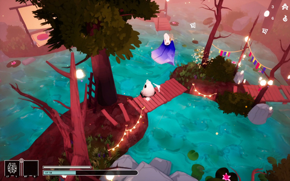
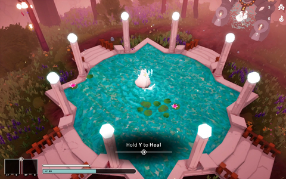
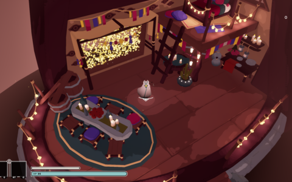
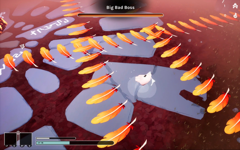

# Jonathan Hedén's Portfolio

This page contains previews of my projects, click on the titles to see my contributions!

## Games

<table>
  <tr>
    <td width="50%">

### [SoulHerd](SoulHerd#soulherd)
      
  </td>
  <td width="25%"></td>
  <td width="25%"></td>
  </tr>
  <tr>
    <td width="100%">

**Development time**: Eight weeks (Apr - Jun '24)  
**Team size**: Three programmers, four artists  
**Engine**: Unreal 

  </td>
  <td width="25%"></td>
  <td width="25%"></td>
  </tr>
    </td>
</table>

### [Spellslingers](Spellslingers#spellslingers)
**Development time**: Seven weeks (Nov '23 - Jan '24)  
**Team size**: Three programmers, three artists  
**Engine**: Unity  
<table>
  <tr>
    <td width="50%"></td>
    <td width="50%"></td>
  </tr>
  <tr>
    <td width="50%"></td>
    <td width="50%"></td>
  </tr>
</table>

---

## Game Jams

### Global Game Jam 2024 - [Shake Spear](https://annalofberg.itch.io/shake-spear)
**Development time**: Three days (Apr '24)  
**Team size**: Three programmers, four artists  
**Engine**: Unity  
<table>
  <tr>
    <td width="50%"></td>
    <td width="50%"></td>
  </tr>
  <tr>
    <td width="50%"></td>
    <td width="50%"></td>
  </tr>
</table>

---

### Leap Year Game Jam 2024 - [What is "Up"?](https://nrdxn.itch.io/what-is-up)
**Development time**: Eight hours (Feb '24)  
**Team size**: Solo  
**Engine**: Unity  
<table>
  <tr>
    <td width="50%"></td>
    <td width="50%"></td>
  </tr>
  <tr>
    <td width="50%"></td>
    <td width="50%"></td>
  </tr>
</table>

---

### Yrgo Student Game Jam 2023 - [We Teathered Felines](https://nrdxn.itch.io/we-teathered-felines)
**Development time**: Three days (Oct '23)  
**Team size**: Three programmers, two artists  
**Engine**: Unity  
<table>
  <tr>
    <td width="50%"></td>
    <td width="50%"></td>
  </tr>
  <tr>
    <td width="50%"></td>
    <td width="50%"></td>
  </tr>
</table>

---

### Yrgo Student Game Jam 2023 - [Katt-Boom!](https://nrdxn.itch.io/katt-boom)
**Development time**: Three days (Sep '23)  
**Team size**: Two programmers, two artists  
**Engine**: Unity  
<table>
  <tr>
    <td width="50%"></td>
    <td width="50%"></td>
  </tr>
  <tr>
    <td width="50%"></td>
    <td width="50%"></td>
  </tr>
</table>
