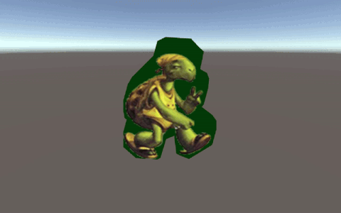

# Game Dev Portfolio
This page contains previews of my projects, click on the titles for details on my contributions.

Disclaimer

I love writing code, unlike taking screenshots/videos and writing short stories about it (although I do enjoy discussing code, but I digress).

Because of that, this page is probably going to be under construction for a while longer.

## Games

<table>
  <tr>
  <td width="50%" rowspan="2">

### [SoulHerd](Games/SoulHerd#soulherd)
**Development time**: Eight weeks (Apr - Jun '24)  
**Team size**: Three programmers, four artists  
**Engine**: Unreal  

[itch.io](https://yrgo-game-creator.itch.io/soulherd)
      
  </td>
  <td width="25%" margin="0px" padding="0px"></td>
  <td width="25%" margin="0px" padding="0px"></td>
  </tr>
  <tr>
  <td width="25%"></td>
  <td width="25%"></td>
  </tr>
</table>

<table>
  <tr>
    <td width="50%" rowspan="2">

### [Spellslingers](Games/Spellslingers#spellslingers)
**Development time**: Seven weeks (Nov '23 - Jan '24)  
**Team size**: Three programmers, three artists  
**Engine**: Unity  

[itch.io](https://yrgo-game-creator.itch.io/spellslingers)
      
  </td>
  <td width="25%" margin="0px" padding="0px"></td>
  <td width="25%" margin="0px" padding="0px"></td>
  </tr>
  <tr>
  <td width="25%"></td>
  <td width="25%"></td>
  </tr>
</table>

---

## Game Jams

<table>
  <tr>
    <td width="50%" rowspan="2">

### [What is "Up"?](GameJams/WhatIsUp#what-is-up) - Leap Year Game Jam
**Development time**: Eight hours (Feb '24)  
**Team size**: Solo  

**Engine**: Unity  

[itch.io](https://nrdxn.itch.io/what-is-up)
      
  </td>
  <td width="25%" margin="0px" padding="0px"></td>
  <td width="25%" margin="0px" padding="0px"></td>
  </tr>
  <tr>
  <td width="25%"></td>
  <td width="25%"></td>
  </tr>
</table>

<table>
  <tr>
    <td width="50%" rowspan="2">

### [We Tethered Felines](GameJams/WeTetheredFelines#we-tethered-felines) - Yrgo Student Jam
**Development time**: Three days (Oct '23)  
**Team size**: Three programmers, two artists  
**Engine**: Unity  
      
  </td>
  <td width="25%" margin="0px" padding="0px"></td>
  <td width="25%" margin="0px" padding="0px"></td>
  </tr>
  <tr>
  <td width="25%"></td>
  <td width="25%"></td>
  </tr>
</table>

<table>
  <tr>
    <td width="50%" rowspan="2">
      
### [Katt-Boom!](GameJams/KattBoom#katt-boom) - Yrgo Student Jam
**Development time**: Three days (Sep '23)  
**Team size**: Two programmers, two artists  
**Engine**: Unity  
      
  </td>
  <td width="25%" margin="0px" padding="0px"></td>
  <td width="25%" margin="0px" padding="0px"></td>
  </tr>
  <tr>
  <td width="25%"></td>
  <td width="25%"></td>
  </tr>
</table>

---

## Prototypes and PoCs

<table>
  <tr>
    <td width="50%" rowspan="2">

### [Third Person Portal](Prototypes/ThirdPersonPortal#third-person-portal)
**Development time**: Three weeks (Mar '24)   
**Team size**: Solo  
**Engine**: Unreal  
      
  </td>
  <td width="25%" margin="0px" padding="0px"></td>
  <td width="25%" margin="0px" padding="0px"></td>
  </tr>
  <tr>
  <td width="25%"></td>
  <td width="25%"></td>
  </tr>
</table>

<table>
  <tr>
    <td width="50%" rowspan="2">

### [Board Game Utils](Prototypes/BoardGameUtils#board-game-utils)
**Development time**: One week (Jan '24)  
**Team size**: Solo  
**Engine**: Unity  
      
  </td>
  <td width="25%" margin="0px" padding="0px"></td>
  <td width="25%" margin="0px" padding="0px"></td>
  </tr>
  <tr>
  <td width="25%"></td>
  <td width="25%"></td>
  </tr>
</table>
